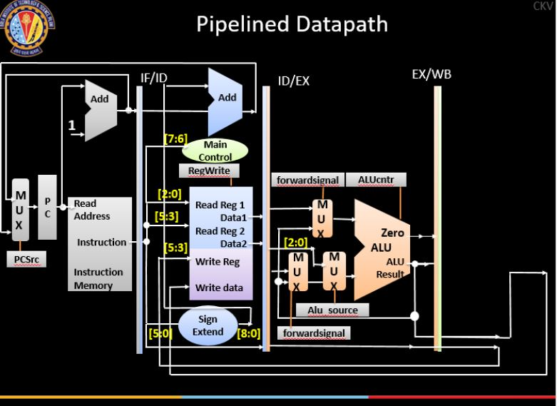

# MIPS Pipelined Processor
 Designed a 5-stage pipelined microprocessor for a subset of MIPS ISA. Coded datapath and controlpath in Verilog and verified functioning on FPGA

Datapath of the processor is shown below

